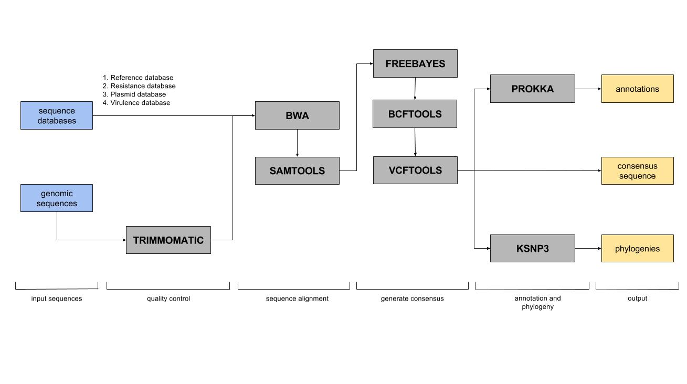

Pipeline Description
====================

Overview
--------
What follows is a detailed explanation of our choices of software for inclusion in our WGS analytic pipeline, and how that pipeline is organized to produce a high confidence and comprehensive description of the bacterial genome.

Alignment
---------

In our alignment pipeline, we have implemented several custom databases against which WGS data can be aligned. First, low quality bases and sequences are removed from the sequence data. The cleaned data from eachisolate are then aligned to a user-supplied reference database; sequence variations identified by this alignment can then be used to compare genomes against one another and against the reference. Next, the sequence data for each isolate are aligned to three databases: an antimicrobial resistance database, a virulence factor database, and a plasmid database. This process allows for the identification of resistance genes, virulence factors or plasmids – all of which are important in a variety of domains, such as food safety. In addition, this allows for the characterization and identification of sequence variability within these genes. The output of the alignment portion of our WGS pipeline is a “consensus” alignment to the reference genome, as well as identification and characterization of genes of food safety significance.

Assembly
--------

There exist many variants of algorithms for performing assembly, nearly all of which are based on the de Bruijn graph. Each of these algorithmic variants has different strengths and weaknesses, and therefore integrating multiple approaches can yield better results than a single algorithm in isolation. For our WGS pipeline, we have chosen to utilize a number of *de novo* assembly tools (Abyss, IDBA-UD, SPades, and Velvet). Contigs produced from each of these assemblies is then integrated with a tool called CISA to form a hybrid assembly, which has shown to produce more accurate and contiguous assemblies, compared to using results produced by a single assembler. The resulting assembly is then passed on to another program called Prokka, which identifies regions in the genome that code for genes (as well as tRNA and tmRNA) and labels them using available databases – a process called annotation. Prokka uses Prodigal to find protein-coding sequences (CDS), and then uses a hierarchical approach based on several different databases to label these sequences. The output of the assembly module are the integrated contigs from each assembler, as well as a fully annotated hybrid assembly.

.. image:: _images/assembly.jpg
   :height: 1500px
   :width: 1250px
   :scale: 50 %
   :alt: alternate text
   :align: center
