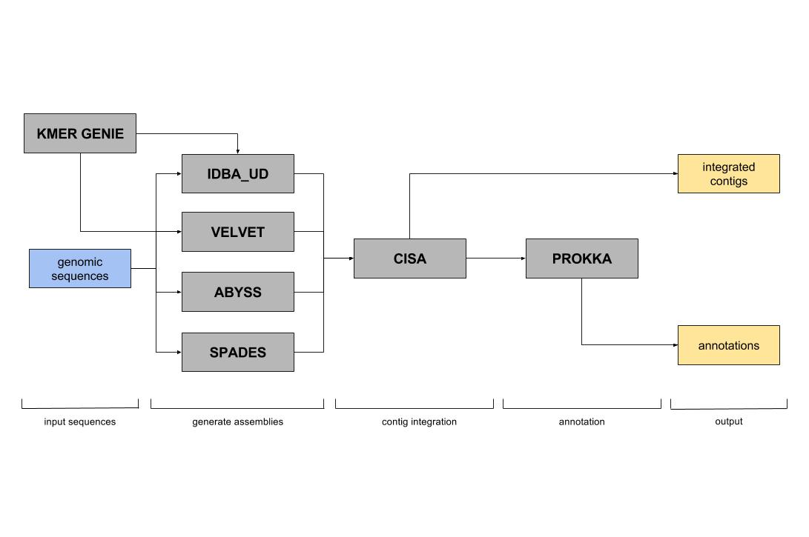

Pipeline Description
====================

Overview
--------
What follows is a detailed explanation of our choices of software for inclusion in our WGS analytic pipeline, and how that pipeline is organized to produce a high confidence and comprehensive description of the bacterial genome.

Alignment
---------
Although assembly is currently the standard approach for analyzing bacterial WGS data, it poses several potential disadvantages: first, it can result in misassembled genomes (e.g., genes in the wrong order/location/quantity); second, it can lead to a loss of genome resolution (e.g., reads not included in the assembly are “discarded”, and intra-isolate sequence variability can be collapsed within a contig); and third, it is a relatively slow and resource-intensive process to build the assembly itself. Alignment can address the latter two concerns by sidestepping the need for assembly of DNA reads into larger contigs. At the foundation of alignment is a matching process in which DNA reads from the sequence data (the query) are compared to a database of known DNA sequences (the reference). The reference can be anything from an entire genome to a small gene (or genes) of interest. The DNA is aligned to the reference and areas of mismatch (i.e., SNPs or indels) can be flagged and analyzed.

In our pipeline, we have implemented several custom databases against which WGS data can be aligned. First, the sequence data for each isolate are aligned to the reference genome from NCBI; sequence variations identified by this alignment can then be used to compare genomes against one another and against the reference. Next, the sequence data for each isolate are aligned to three databases: an antimicrobial resistance database, a virulence factor database, and a plasmid database. This process allows us to identify whether the sequence data contain resistance genes, virulence factors or plasmids – all of which are important for food safety purposes. In addition, we can characterize any identified genes and look at sequence variability within those genes. The output of the alignment portion of our WGS pipeline is therefore a “consensus” alignment to the reference genome, as well as identification and characterization of genes of food safety significance.

Assembly
--------
Modern Next-Generation Sequencing methods produce short fragments of DNA that have been isolated from a given source; in this case, that source is (hopefully) the genomic DNA of a single (or multiple clonal) bacteria. In order for us to understand the origin, order and content of the bacterial genome, these fragments of short “reads” of DNA must be pieced back together. In the same way that a puzzle can be reconstructed from the unique shape and color of its pieces, we can utilize the order of DNA bases (ACTG) to overlap sequence fragments into an assembly. Typically, these assemblies are comprised of several long, pieced-together fragments of DNA known as contigs; however, often not all contigs can be pieced together to fully reconstruct the bacterial genome.

There exist many variants of algorithms for performing assembly, nearly all of which are based on the de Bruijn graph. Each of these algorithmic variants has different strengths and weaknesses, and therefore integrating multiple approaches can yield better results than a single algorithm in isolation. For our WGS pipeline, we have chosen to utilize a suite of tools called iMetAMOS, which allows us to perform assembly using five separate assemblers (algorithms): SPAdes, IDBA-UD, Velvet, ABySS, and Edena. In addition, the length of sequence (i.e., k-mer size) that is used to find overlapping stretches of DNA and form contigs can significantly alter the quality of the assembly. Therefore, the iMetAMOS suite includes a k-mer size selection step using Kmer genie (citation). Once a kmer size is selected, each of the 5 assemblers is used to produce assemblies, and for each assembler that successfully produces contigs, we then combine the results into one master assembly using the program CISA. The resulting assembly is then passed on to another program called Prokka (citation), which identifies regions in the genome that code for genes (as well as tRNA and tmRNA) and labels them using available databases – a process called annotation. Prokka uses Prodigal (citation) to find protein-coding sequences (CDS), and then uses a hierarchical approach based on several different databases to label these sequences. In addition, we have compiled a custom annotation database specifically for Listeria monocytogenes, and have integrated it into the prokka workflow. The result of the assembly portion of our WGS pipeline is the integrated, master assembly file that is fully annotated.

